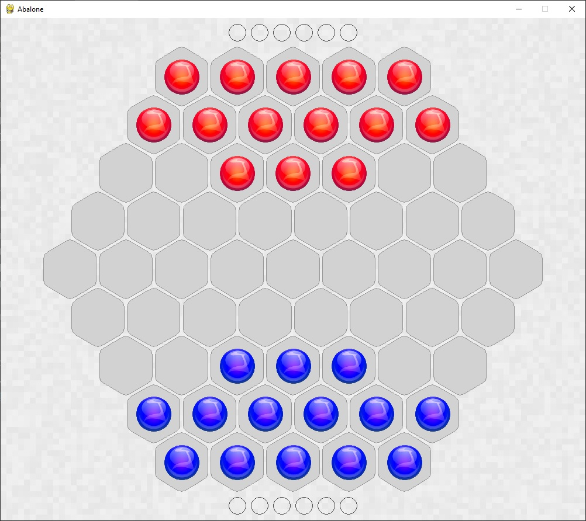
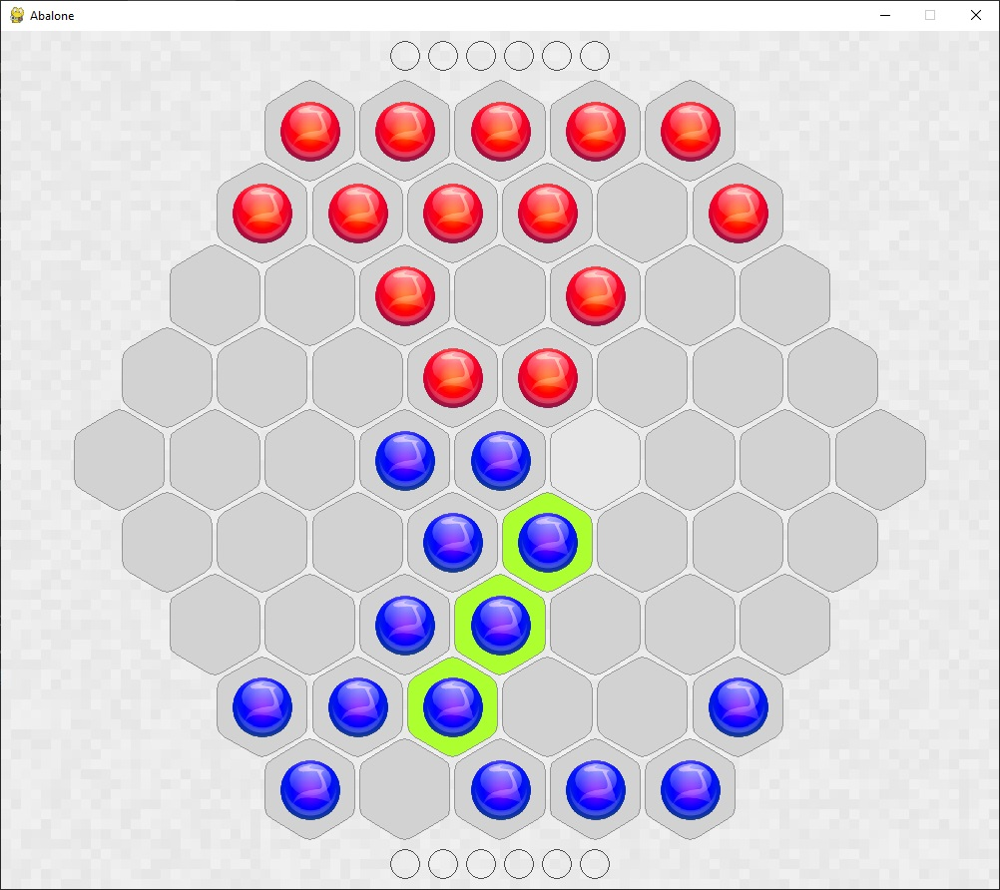
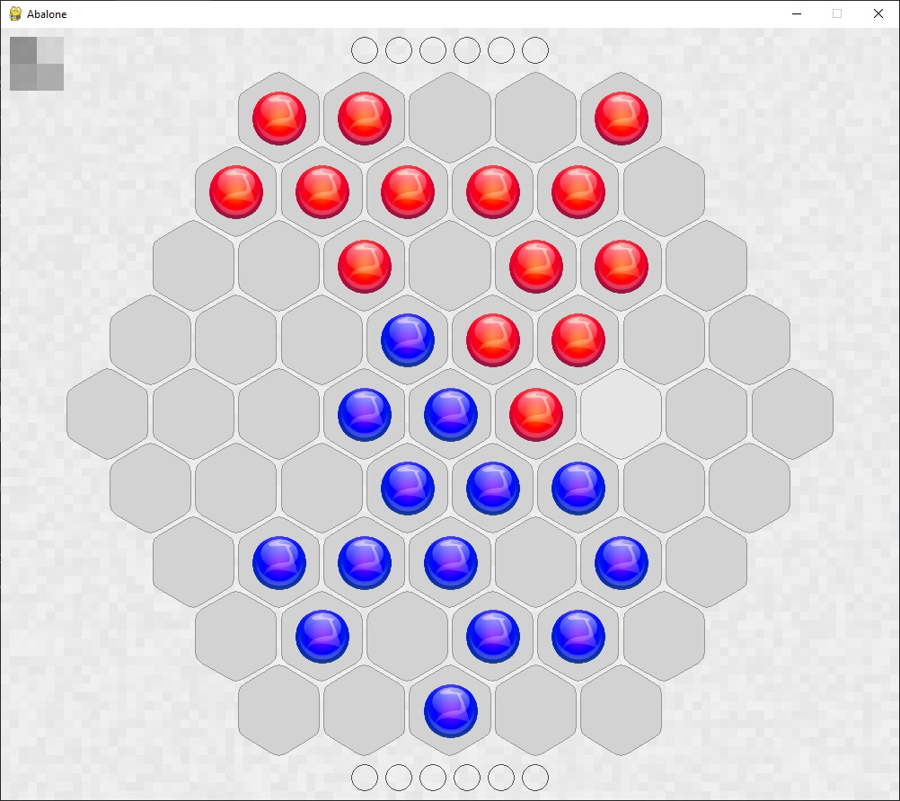
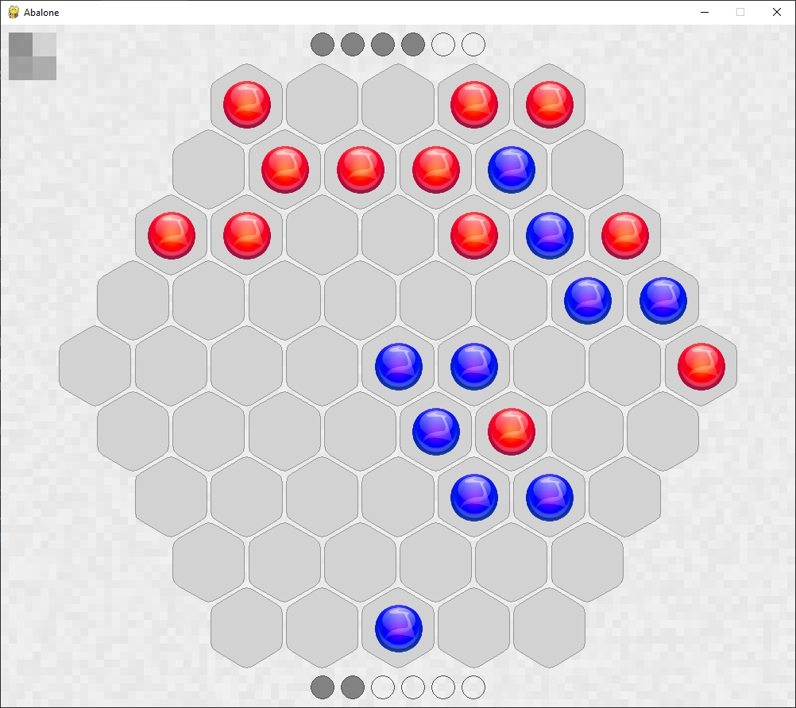
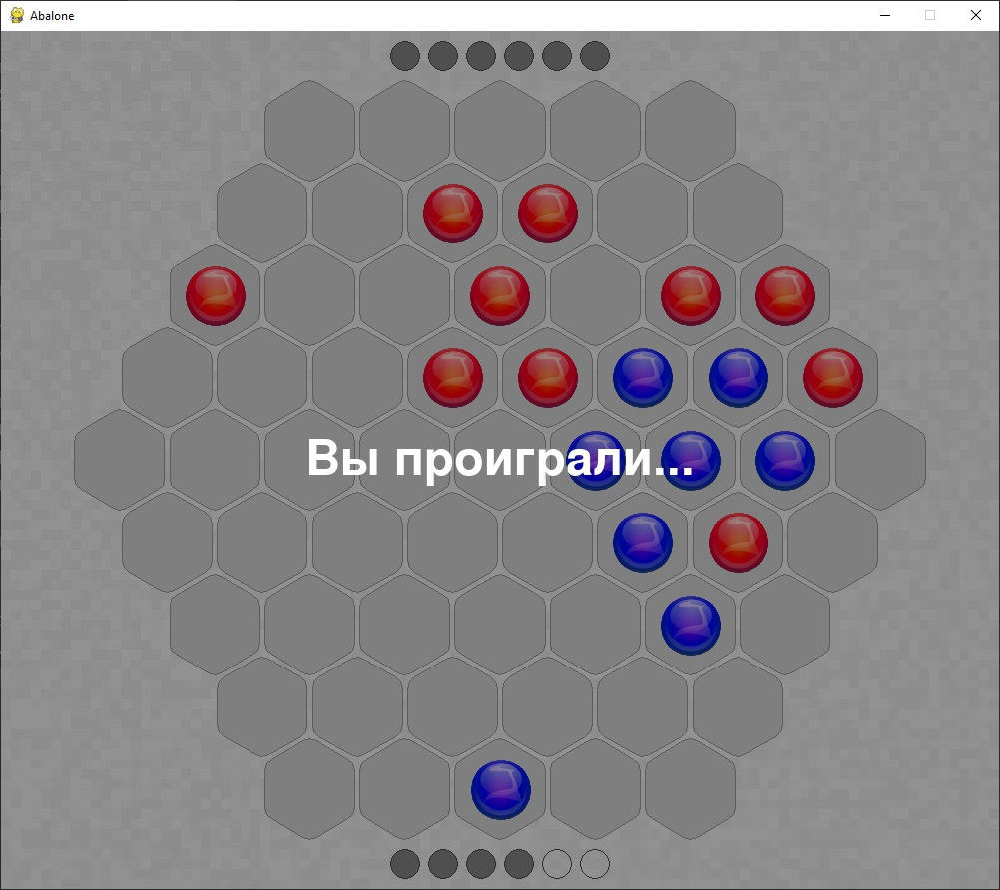

# Abalone


Абалон - это настольная стратегическая игра, придуманная французскими игровыми
дизайнерами в 1987 году. Правила игры подробно описаны [вот тут](https://ru.wikipedia.org/wiki/%D0%90%D0%B1%D0%B0%D0%BB%D0%BE%D0%BD_(%D0%B8%D0%B3%D1%80%D0%B0)).
Вкратце, суть игры состоит в том, что нужно своими шариками (двигая их по определенным
правилам) вытолкнуть за пределы игрового поля шесть шариков противника. Тот, кто первым
сделал это, тот и побеждает в партии.

Я давно хотел реализовать эту игру на языке Python, но работа с игровым полем из
шестиугольников значительно сложнее, чем с полем из квадратов, как например, в 
шахматах или реверси.

Прежде чем приступить к работе над этим проектом, я реализовал два других 
([Hexagon](https://github.com/SergeyLebidko/Hexagon) и [HexenSnake](https://github.com/SergeyLebidko/HexenSnake)) проекта,
в которых игра также ведется на игровом поле из гексов. Это позволило мне
выбрать наиболее удачные решения для работы с подобными сетками. Их я и применил в Абалон.

Для расчета ответного хода использован алгоритм альфа-бета отсечения, применяемый во
многих играх, например, в тех же шахматах. Если и дальше проводить аналогию с шахматами
(их я, кстати, тоже уже [реализовывал](https://github.com/SergeyLebidko/PyChess) на Python),
то следуем заметить, что процесс поиска доступных ходов в Абалон проще, чем в шахматах,
так как все шарики на игровом поле эквивалентны друг другу в отличие от шахматных фигур.
Однако, на скорость поиска хода очень сильно влияет необходимость работать с шестиугольной сеткой.

Также, в Абалон (чего я никак не ожидал, начиная работать над проектом) очень большое среднее
количество доступных ходов в любой заданной позиции, сравнимое с таковым в шахматах!

В среднем из любой позиции можно сделать около 50 ходов. Таким образом, если просчитывать на глубину
всего лишь 2 ходов, то нужно рассмотреть 50 * 50 = 2500 вариантов. Просчитываем на 3 хода - получаем
уже 125 000 вариантов, на 4 хода - 6 250 000 вариантов! Но алгоритм альфа-бета отсечения с хорошей функцией
оценки позиции позволяет сильно сократить это количество.  
  
Мне удалось реализовать алгоритм, который просчитывает ситуацию на 5 ходов вперед. При этом 
среднее количество оцениваемых позиций находится в пределах 50 000 - 100 000. Время расчета ответного
хода компьютера удалось уложить в 2 минуты. На получение и оценку одной позиции тратиться в среднем
около 300-500 микросекунд. Эти данные я привожу для компьютера с процессором Intel Core i5-750.

Также, хотя и очень редко, на игровом поле могут возникать ситуации с аномально большим количеством
доступных ходов, которое при просчете на большую глубину порождают миллионы вариантов не отсекаемых
даже при использовании всех доступных оптимизаций. В этом случае время генерации ответного хода
становится слишком большим и в игре возникает довольно неприятная пауза до 10-15. минут! Чтобы избежать
таких неприятных для игрока пауз, я ввел в алгоритм ограничение на просмотр - не более 500 000 ходов.  

Но такие ситуации возникают, повторюсь, редко и даже с учетом лимита, компьютеру всегда удается 
выбрать удачный ход.

Также, стоит заметить, что во многих случаях в этом проекте я **сознательно** жертвую читаемостью
кода для получения большей скорости его выполнения. Я не использую ООП везде, где этого можно избежать
даже пожертвовав читаемостью. Для хранения основных данных я использую не объекты, а простейшие
структуры типа словаря, списка или множества, хотя это и доставляет некоторые неудобства (часто
хочется упаковать в одну структуру и данные и код для их обработки). По этой причине я на самом начальном
этапе разработки отказался от таких классов как Ball (шарик) и Cell (ячейка), хотя был большой соблазн
использовать их для представления отдельных объектов игры.
Хотя на самом "верхнем" уровне, я безусловно использую ООП для структурирования кода, но только там,
где это не будет влиять на скорость.

Также я стараюсь не использовать некоторые приемы программирования, которые могут очень сильно
замедлить код. Например, перехват исключений. Да, он делается довольно быстро, но не тогда, когда вам 
нужно выполнить несколько тысяч перехватов в секунду. В таких случаях становиться ясно, что
это очень медленная операция. У меня был соблазн использовать исключения для обнаружения ситуации
доступа к ключу, отсутствующему в словаре. Это уменьшило бы объем кода сразу во многих местах
и упростило бы его. Но в ходе тестирования я увидел, что отказ от этого приема дает очень большой
рост производительности.

Еще я стараюсь генерировать все необходимые мне структуры данных заранее, чтобы не тратить драгоценные 
микросекунды на их создание "на лету" во время расчета ответного хода.

Из-за этого в коде можно встретить вещи, подобные вот этим:

```Python
DELTA_KEYS = [(0, 1, 1), (1, 0, 1), (1, -1, 0), (0, -1, -1), (-1, 0, -1), (-1, 1, 0)]
SHORT_DELTA_KEYS = DELTA_KEYS[:3]

LINE_PATTERNS = ['**#r', '***##r', '***##e', '***#e', '**#e', '***e', '**e']
LINE_PATTERNS_SET = set(LINE_PATTERNS)

OTHER_SIDE_DICT = {CMP_SIDE: PLAYER_SIDE, PLAYER_SIDE: CMP_SIDE}
```

или вот этим:

```Python
# Готовим список паттернов для проверки наличия выталкивающих ходов
self.drop_patterns = []
```

Все в совокупности, эти меры позволили мне добиться снижения времени получения и оценки одной позиции
с 1500 - 1600 микросекунд до 400 - 500 микросекунд! (на core i5-750). Это и дало возможность уместить 
просчет нескольких сотен тысяч вариантов в 2 минуты :)

Еще мне удалось вручную реализовать некое подобие асинхронного выполнения расчета ходов.
Моя реализация алгоритма альфа-бета отсечения (который является рекурсивным) может периодически,
после оценки определенного количества ходов, временно отдавать управление вызвавшему коду.
Это позволяет избежать неприятного подвисания программы, когда она "обдумывает" ответный ход.

Играть очень просто: чтобы начать надо запустить файл start.pyw (играть шариками случайно
выбранного цвета) или start_blue.pyw (играть синими), или же start_red.pyw (играть красными).

Игрок всегда делает первый ход (да, тут я немного отступил отправил). 

Для выбора шариков нужно использовать левую кнопку мышки, для указания, куда их надо передвинуть - правую.

В любой момент ход можно откатить - для этого надо нажать пробел. Вот и всё :)  

P.S.
Для запуска игры должена быть установлена библиотека pygame (у меня версия 2.0.1) и, естественно, интерпретатор
Python (у меня версия 3.8.5). Я тестировал игру на windows 10 x64. 

Скриншоты игры:









